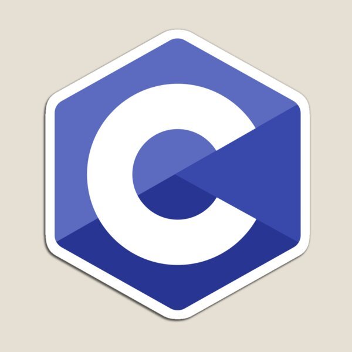

# Hi, I'm Hugo 👋

🎓 **Holberton School**
💻 Passionate about **programming**, **cybersecurity**, **3D**, and **game development**
🎯 Goal: improve my skills and build various technical projects

---

## 📊 GitHub Stats

---

## 🔧 Technologies I'm learning

  
  

---

## 🚀 Upcoming projects
- Automation scripts
- Cybersecurity / CTF challenges
- 3D and game development projects

---

Thanks for visiting my profile! 🙌
